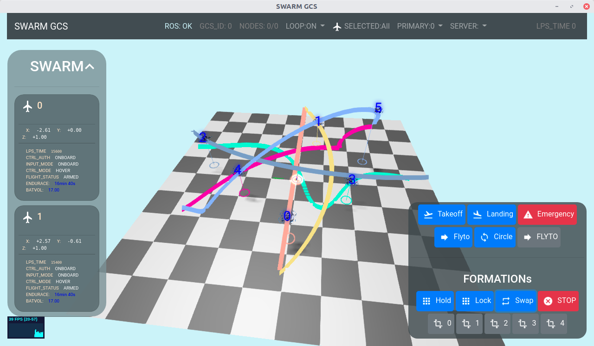
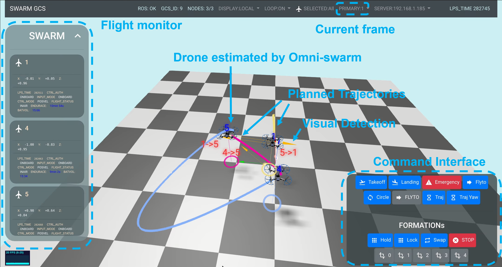

# Intro


*swarm\_gcs* is a 3d user interface (or ground station) for robots and aerial swarm based on ROS and Three.js. 
You may use it as a web app on your PC and mobile devices (iPad for example) or standalone application.

This project stands as a part of Omni-swarm: A Decentralized Omnidirectional Visual-Inertial-UWB State Estimation System for Aerial Swarm.
You may use it alone on any type of robot or as a part of Omni-swarm for swarm robots.


# Prerequisite
To take the full advantage of swarm\_gcs, Messages defined in [swarm\_msgs](https://github.com/HKUST-Swarm/swarm_msgs) and our custom [mavlink](https://github.com/HKUST-Swarm/mavlink) protocol is required now.

We are going to modified protocols and messages for swarm\_gcs to be more generic.

The swarm mode of swarm\_gcs:


The single drone mode on an iPad with dense map:


# Related Paper
__Omni-swarm: A Decentralized Omnidirectional Visual-Inertial-UWB State Estimation System for Aerial Swarm__ The VINS-Fisheye is a part of Omni-swarm. If you want use VIN-Fisheye as a part of your research project, please cite this paper.

# Build
Prerequirements
LCM is required now.

```
git clone https://github.com/lcm-proj/lcm
mkdir -p lcm/build
cd lcm/build
cmake -DCMAKE_BUILD_TYPE=Release ..
make -j8
sudo make install
```

For ros, rosbridge_suite and inf_uwb_ros is required. System rosbridge_suite may conflict with latest Python.
```
pip install pymongo
pip install autobahn
pip install twisted
sudo apt install ros-<ROS_DISTRO>-rosauth
```

For rosbridge
```
cd catkin_ws/src
git clone https://github.com/RobotWebTools/rosbridge_suite
git clone https://github.com/HKUST-Swarm/inf_uwb_ros
```

Build to executable

```bash
./build.sh
```

# Usage
Way 0: Most convient way:

```
roslaunch rosbridge_server rosbridge_websocket.launch
```

Then open 

http://swarm-gcs.xuhao1.me in browser on PC or mobile devices and select Server IP: (127.0.0.1 if you are running rosbridge on localhost)


Way 2: Use nginx as webserver

Clone swarm_gcs
```
cd path-to-swarm_gcs/
git clone https://github.com/HKUST-Swarm/swarm_gcs
git submodule init
git submodule update
```


```
sudo apt install nginx
```

Modified mime types for serving mjs file
>sudo gedit /etc/nginx/mime.types 

Add     
>application/javascript mjs;

after line 8.

Modified default server
>sudo gedit /etc/nginx/sites-enabled/default

to 
```

server {
	listen 80 default_server;
	listen [::]:80 default_server;

	root path-to-swarm_gcs/swarm_gcs;

	server_name _;

	location / {
		# First attempt to serve request as file, then
		# as directory, then fall back to displaying a 404.
		try_files $uri $uri/ =404;
	}

}

```

And reload nginx:
```
sudo nginx -s reload
```
Then open http://127.0.0.1 or open http://your-ip/ on mobile device (iPad 12 inch) or other computer. And for ros serving:

```
roslaunch launch/swarm_simulation.launch
```

Note: After updating code, you may need to clear your Chrome cache or refresh with Ctrl+F5.

Way 3: Download executable from Release and unzip it

```bash
cd swarm_gcs-linux-x64
roslaunch launch/swarm_simulation.launch
```

```
cd swarm_gcs-linux-x64
./swarm_gcs
```

Way 4:

Clone swarm_gcs
```
cd path-to-swarm_gcs/
git clone https://github.com/HKUST-Swarm/swarm_gcs
git submodule init
git submodule update
```

Install nodejs and http-server.
```
sudo npm install http-server -g
```

```
cd swarm_gcs
http-server -c-1
```
Then open http://127.0.0.1:8080 in Chrome

