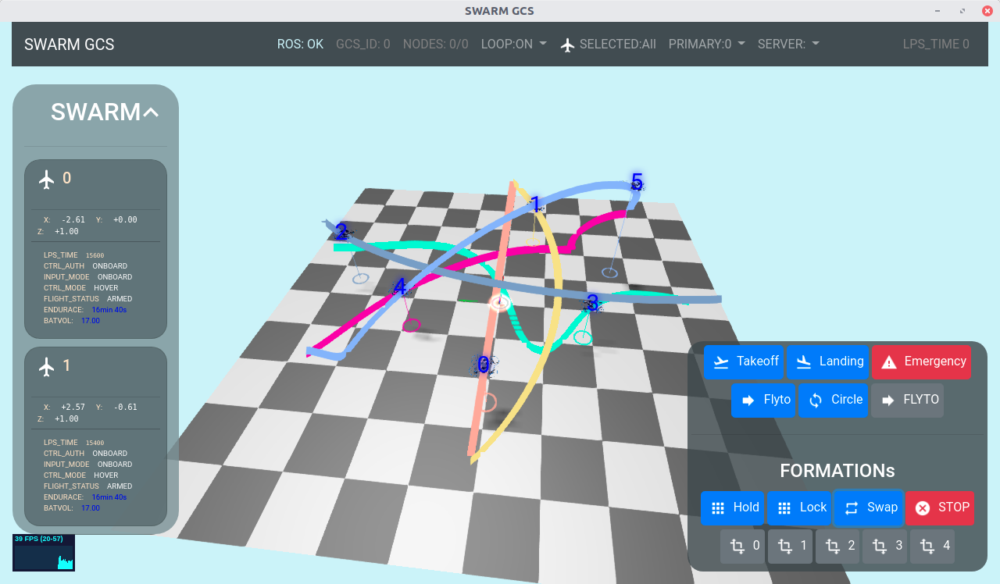
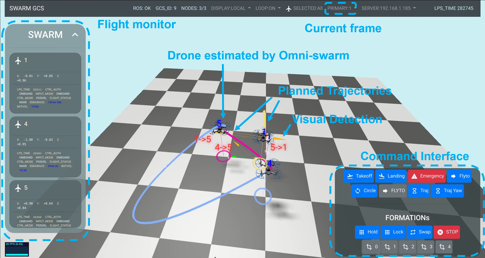

# Intro


*swarm\_gcs* is a 3d user interface (or ground station) for robots and aerial swarm based on ROS and Three.js. 
You may use it as a web app on your PC and mobile devices (iPad for example) or standalone application.

This project stands as a part of __[Omni-swarm](https://arxiv.org/abs/2103.04131): A Decentralized Omnidirectional Visual-Inertial-UWB State Estimation System for Aerial Swarm__.
You may use it alone on any type of robot or as a part of Omni-swarm for swarm robots.


# Prerequisite
To take the full advantage of swarm\_gcs, messages defined in [swarm\_msgs](https://github.com/HKUST-Swarm/swarm_msgs) and our custom [mavlink](https://github.com/HKUST-Swarm/mavlink) protocol are required now.
We are going to modified protocols and messages for swarm\_gcs to be more generic.

The swarm mode of swarm\_gcs:


The single drone mode on an iPad with dense map:


# Related Paper
__Omni-swarm: A Decentralized Omnidirectional Visual-Inertial-UWB State Estimation System for Aerial Swarm__ The VINS-Fisheye is a part of Omni-swarm. If you want use VIN-Fisheye as a part of your research project, please cite this paper.

# Install

Node.js dependencies are the only JavaScript dependency source. The project no longer uses Git submodules for Three.js or Material Icons.

```bash
git clone https://github.com/HKUST-Swarm/swarm_gcs
cd swarm_gcs
npm ci
```

`package-lock.json` pins the exact dependency graph. Run `npm ci` once while a registry or populated npm cache is available; Web and Electron execution does not require public Internet access afterwards.

# Electron

Start ROS as needed, then launch the desktop application with the project-local Electron binary:

```bash
roscore
npm start
```

Electron first attempts the native `rosnodejs` transport and falls back to the local/LAN rosbridge WebSocket transport when native ROS packages are unavailable.

# Web

Start rosbridge and the dependency-free local static server:

```bash
roslaunch rosbridge_server rosbridge_websocket.launch
npm run web
```

Open <http://127.0.0.1:8080>. To listen on another interface or port:

```bash
HOST=0.0.0.0 HTTP_PORT=8000 npm run web
```

The web server deliberately serves the repository root, including the locked browser distributions under `node_modules`. Bootstrap, jQuery, Popper, Vue, Three.js, roslib, fonts, models, and icons are all loaded locally.

# Offline verification

Verify the pinned packages and every runtime asset used by all four HTML entry points:

```bash
npm test
```

This guarantees offline operation after dependencies have been installed. A fresh clone on an air-gapped machine still needs either a populated npm cache or a prebuilt release containing `node_modules`.

# Testing

The deterministic emulator can be used without flight hardware:

```bash
python3 emulator_for_gcs/main.py
```

For the ROS simulation stack:

```bash
roslaunch launch/swarm_simulation.launch
```

# Packaging

Build the MAVLink browser bundle and package the Electron application with local project tools:

```bash
npm run package
```

Docker users can run `./gcs_docker.sh web` or `./gcs_docker.sh electron` after building the image.
